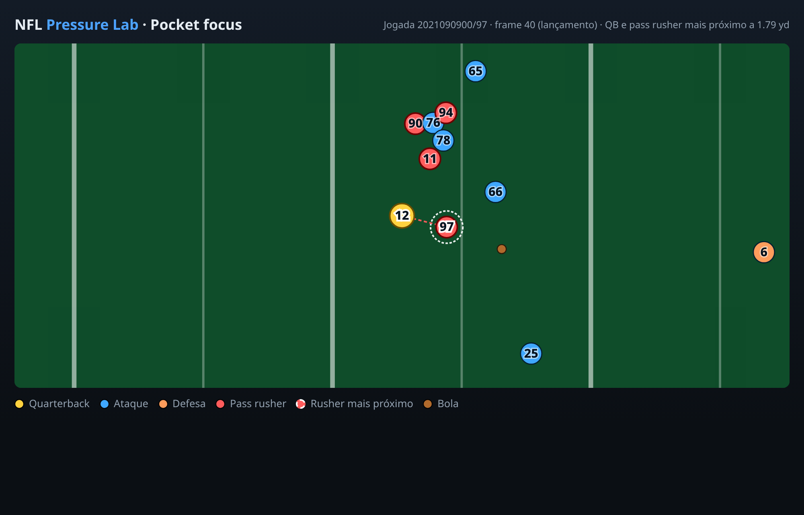
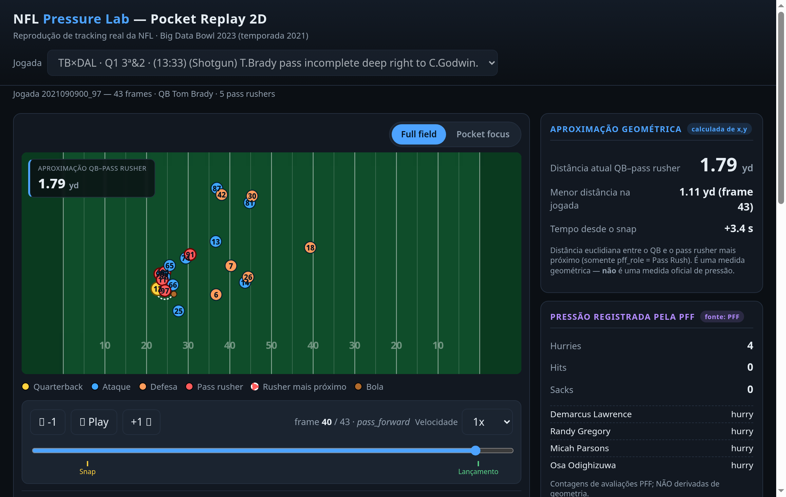
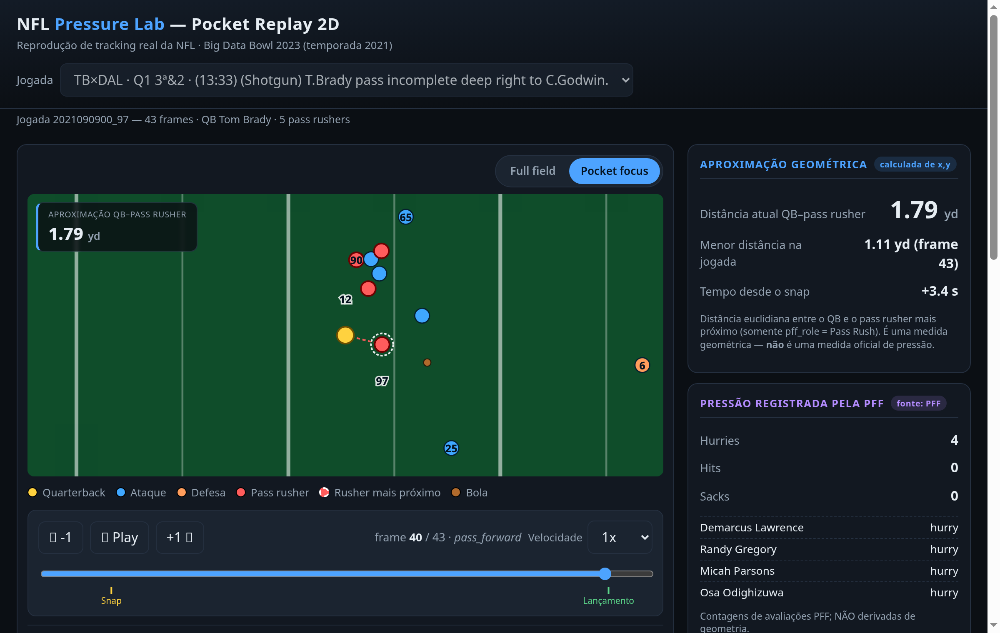
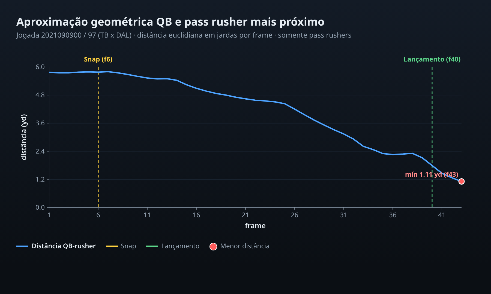
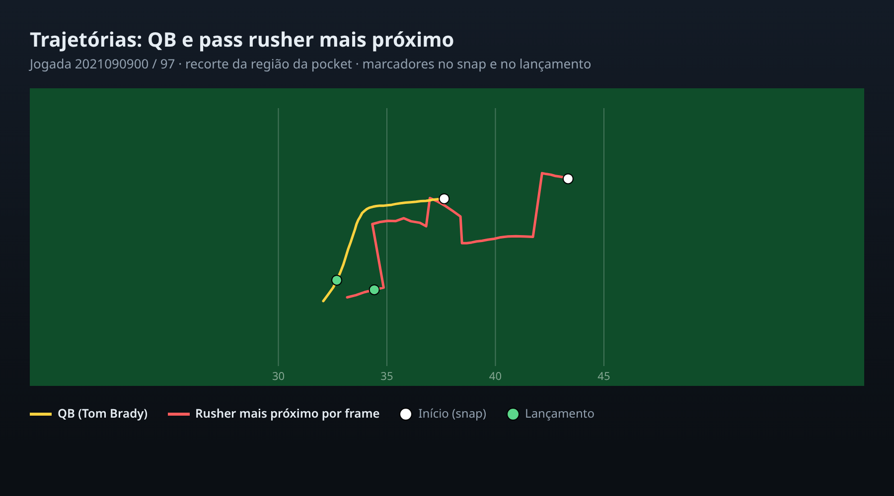
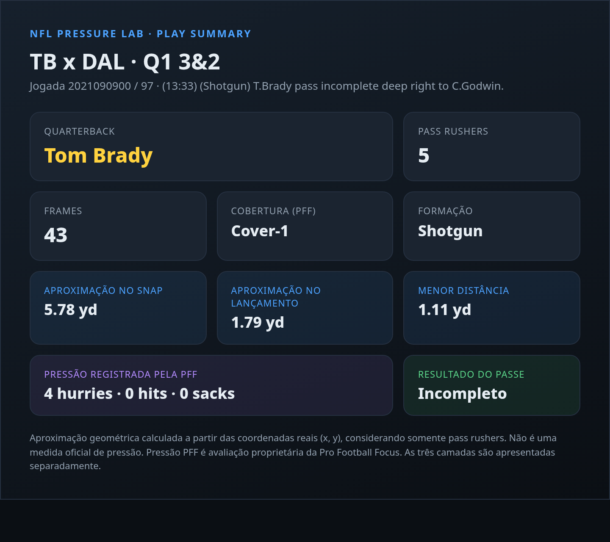
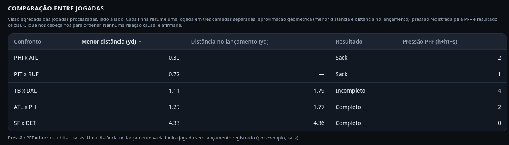

<div align="center">

# NFL Pressure Lab

### Race Against Time | Análise Tática da Pressão Defensiva

Aplicação web que reproduz o tracking real da NFL e mede a aproximação entre o quarterback e o pass rush, quadro a quadro.

Desenvolvida para o Hackathon NFL Big Data Bowl RJ (AWS, NFL e Estácio), com apoio do Kiro (ferramenta da AWS) em um fluxo orientado por especificações: requisitos, design e tarefas versionados junto ao código.

<br />


<br />

Demonstração online (GitHub Pages): https://nayanearaujo.github.io/nfl-pressure-lab/app/index.html

Código e instruções de execução local: [github.com/Nayanearaujo/nfl-pressure-lab](https://github.com/Nayanearaujo/nfl-pressure-lab) (ver a seção Instalação e execução).

</div>

---

## Apresentação

O NFL Pressure Lab é uma aplicação web de engenharia de dados e visualização esportiva que reproduz a movimentação real de jogadores da NFL e analisa a aproximação entre o quarterback e os defensores encarregados do pass rush.

<div align="center">



</div>

A pergunta central do projeto é: como a movimentação dos defensores influencia o espaço e o tempo disponíveis para o quarterback executar uma jogada.

A funcionalidade central é o Pocket Replay 2D, uma visão superior do campo que reproduz a jogada quadro a quadro (frame a frame) a partir de dados de rastreamento a 10 Hz. A interface destaca os pass rushers, desenha a linha entre o quarterback e o pass rusher mais próximo e exibe a distância geométrica sincronizada com o quadro atual.

A aplicação inclui um seletor com cinco jogadas de cenários distintos: passe incompleto sob pressão, sack, hit registrado, pocket limpo e diferentes confrontos de times.

O projeto separa de forma explícita três camadas de informação e não as combina:

1. Aproximação geométrica: distância euclidiana calculada a partir das coordenadas reais (x, y).
2. Pressão registrada pela PFF: indicadores de hit, hurry e sack, avaliados pela Pro Football Focus.
3. Resultado da jogada: resultado do passe e jardas obtidas.

A aproximação geométrica não é apresentada como medida oficial de pressão, e nenhuma relação de causalidade é afirmada.

## Status do projeto

A aplicação está funcional. Os componentes abaixo estão concluídos.

| Componente | Situação |
| :--- | :--- |
| Referência do dataset | Concluído |
| Análise de viabilidade | Concluído |
| Especificação técnica | Concluído |
| Estrutura do projeto | Concluído |
| Pré-processamento Python | Concluído |
| Interface web Pocket Replay 2D | Concluído |
| Modo Pocket Focus | Concluído |
| Gráfico temporal sincronizado | Concluído |
| Comparação entre jogadas | Concluído |
| Testes automatizados | 21 aprovados |

## Demonstração visual

Visualizações estáticas da jogada demonstrativa 2021090900 / 97 (TB x DAL). São todas a mesma jogada, em recortes e gráficos diferentes. Na aplicação, estas imagens formam a galeria "Visualizações complementares", com a explicação completa exibida ao ampliar cada imagem.

A imagem de abertura, no topo do documento, mostra o modo Pocket focus no frame do lançamento. As visualizações abaixo detalham a interface e a análise.

Interface completa (modo Full field)

- O que mostra: a interface no frame 38, com o campo inteiro, os controles de reprodução, o painel das três camadas de informação e o gráfico temporal.
- Como interpretar: por padrão, todos os jogadores com número disponível são identificados; quando dois números ficariam sobrepostos, um deles é deslocado com uma linha-guia curta e recebe contorno para contraste sobre o gramado. Na aglomeração da linha de scrimmage, o número de cada jogador também aparece ao passar o cursor, focar pelo teclado ou tocar no marcador.
- Observação: o frame 38 (pass forward detectado automaticamente, 3,2 s após o snap) mantém os recebedores espalhados, o que facilita a leitura do conjunto.

<div align="center">



</div>

Pocket focus (interface completa)

- O que mostra: a mesma interface no modo Pocket focus, ampliando a região do quarterback no frame do lançamento.
- Como interpretar: o contorno tracejado destaca o pass rusher mais próximo. O zoom altera apenas a visualização.
- Observação: o zoom não altera as coordenadas dos jogadores nem as distâncias calculadas.

<div align="center">



</div>

Linha do tempo da distância

- O que mostra: a evolução da distância ao longo da jogada. O eixo X é o frame e o eixo Y é a distância em jardas.
- Como interpretar: a curva representa a menor distância entre o quarterback e os pass rushers identificados em cada frame. As marcações são snap no frame 6 (cerca de 5.78 jardas) e lançamento no frame 40 (cerca de 1.79 jarda); a menor distância observada é 1.11 jarda no frame 43.
- Observação: a menor distância ocorre após o lançamento, não no momento da decisão de lançar. É uma versão estática do gráfico interativo apresentado na aplicação.

<div align="center">



</div>

Posição do pass rusher mais próximo por frame

- O que mostra: a trajetória contínua do quarterback (linha amarela) e a posição do pass rusher mais próximo em cada frame.
- Como interpretar: os segmentos coloridos são interrompidos sempre que muda o identificador do defensor; portanto, não representam a trajetória contínua de um único atleta. Os marcadores indicam o snap e o lançamento.
- Observação: nesta jogada, o defensor mais próximo muda entre Carlos Watkins, Micah Parsons, Demarcus Lawrence e Osa Odighizuwa.

<div align="center">



</div>

Cartão de resumo da jogada

- O que mostra: um resumo com três informações distintas e separadas, A aproximação geométrica calculada, B pressão registrada pela PFF, e C resultado oficial da jogada.
- Como interpretar: os 4 hurries são registros da PFF e não foram calculados a partir da distância.
- Observação: o passe foi incompleto, mas esse resultado não é atribuído à aproximação dos defensores como relação causal demonstrada.

<div align="center">



</div>

Comparação entre jogadas

- O que mostra: a visão agregada das cinco jogadas processadas, lado a lado, em uma tabela. Cada linha traz o confronto, a menor aproximação geométrica na jogada, a aproximação no momento do lançamento, o resultado oficial do passe e a contagem de pressão registrada pela PFF (soma de hurries, hits e sacks). Diferente das imagens acima, que detalham a mesma jogada demonstrativa, esta tabela reúne as cinco jogadas.
- Como interpretar: a tabela é ordenável; nesta captura, está ordenada pela menor distância em ordem crescente, do confronto mais apertado (PHI x ATL, 0,30 jarda) ao de pocket mais limpa (SF x DET, 4,33 jardas). As três camadas de informação seguem separadas: aproximação geométrica, pressão da PFF e resultado. Um traço na coluna de distância no lançamento indica jogada sem lançamento registrado, como nos sacks.
- Observação: as colunas não são combinadas nem correlacionadas. A proximidade dos defensores e o resultado da jogada aparecem juntos apenas para leitura, sem afirmar relação de causalidade.

<div align="center">



</div>

## Resultados da jogada de demonstração

Valores extraídos diretamente do JSON processado da jogada 2021090900 / 97 (TB x DAL).

- Snap no frame 6 e lançamento no frame 40.
- Aproximação geométrica no snap (frame 6): 5.78 jardas.
- Aproximação geométrica no lançamento (frame 40): 1.79 jarda.
- Menor aproximação observada na jogada: 1.11 jarda, no frame 43, que ocorre após o lançamento.
- Pressão registrada pela PFF: 4 hurries, 0 hits, 0 sacks.
- Resultado do passe: incompleto.

Observações de leitura:

- A distância de 1.79 jarda corresponde ao momento do lançamento (frame 40). A distância de 1.11 jarda corresponde ao frame 43, posterior ao lançamento, e não representa a distância no momento da decisão de lançar.
- A menor distância ao quarterback em cada frame é calculada entre os pass rushers identificados naquele frame. O defensor mais próximo pode mudar ao longo da jogada. Nesta jogada, o defensor mais próximo é, em frames diferentes, Carlos Watkins, Micah Parsons, Demarcus Lawrence e Osa Odighizuwa.
- Estes números descrevem a aproximação geométrica e a pressão avaliada pela PFF de forma separada. Não se afirma que a aproximação dos defensores causou o passe incompleto.

## Stack tecnológica

| Tecnologia | Papel no projeto |
| :--- | :--- |
|  | Pré-processamento dos CSVs e validação automatizada dos dados. |
|  | Reprodução quadro a quadro, controles e interatividade. |
|  | Estrutura da interface. |
|  | Apresentação, tema escuro e layout responsivo. |
|  | Visualização do campo, jogadores, linha de aproximação e gráfico temporal. |
|  | Armazenamento dos dados processados por jogada. |
|  | Controle de versão. |
|  | Hospedagem do repositório. |

O front-end usa JavaScript puro, sem frameworks ou dependências externas. O pré-processamento usa apenas a biblioteca padrão do Python.

### Ferramentas de desenvolvimento

| Ferramenta | Uso no projeto |
| :--- | :--- |
|  | Ferramenta da AWS usada no desenvolvimento: organização de requirements, design e tasks; apoio à implementação; e execução e validação dos testes. |
|  | Hospedagem da demonstração online. |

## Arquitetura

A arquitetura tem duas fases desacopladas, sem back-end em tempo de execução.

```
CSVs originais (dataset NFL)
        |
        v
[ Python: pré-processamento ]  ->  JSON por jogada (leve)
        |
        v
[ Navegador: HTML + CSS + JS + SVG ]  ->  Pocket Replay 2D
```

1. Pré-processamento (Python, offline): lê os CSVs originais do dataset e gera um JSON leve por jogada, contendo frames, jogadores, eventos, distâncias pré-computadas e metadados. O caminho do dataset é configurável, com valor padrão apontando para uma pasta irmã do projeto.
2. Interface (navegador): consome apenas os JSONs processados. O campo e a movimentação são renderizados em SVG e atualizados por quadro. O navegador nunca carrega os CSVs brutos de rastreamento.

A distância entre o quarterback e o pass rusher mais próximo considera exclusivamente os defensores identificados como pass rush no scouting da PFF. O cálculo é feito no pré-processamento em Python e armazenado no JSON, de forma reproduzível a partir das coordenadas.

### Tratamento dos dados e .gitignore

Os CSVs brutos do dataset (jogos, jogadas, scouting e o rastreamento, com centenas de MB) não são versionados neste repositório. O pré-processamento os lê a partir de uma pasta externa e grava apenas o artefato necessário à demonstração: um JSON leve por jogada em `app/data/plays/`. O `.gitignore` bloqueia os dados brutos (por exemplo `data/`, `*.csv` do dataset, e o rastreamento) e artefatos locais como ambientes virtuais e `__pycache__`, mantendo no repositório somente o código e os JSONs de demonstração. Assim, o repositório permanece pequeno e não redistribui os dados de propriedade da NFL e da PFF.

## Estrutura do projeto

```
nfl-pressure-lab/
├── README.md
├── .gitignore
├── src/
│   └── pressure_lab/
│       ├── __init__.py
│       ├── preprocess.py          # pipeline de pré-processamento (CLI)
│       └── aggregate.py           # gera a visão agregada das jogadas (CLI)
├── app/
│   ├── index.html                 # estrutura da interface
│   ├── css/
│   │   └── styles.css             # tema escuro e layout responsivo
│   ├── js/
│   │   ├── app.js                 # orquestração, seletor e controles
│   │   ├── field-renderer.js      # campo SVG, jogadores e enquadramento
│   │   ├── playback.js            # reprodução quadro a quadro
│   │   ├── stats-panel.js         # painel em três camadas
│   │   ├── dist-chart.js          # gráfico temporal da distância
│   │   └── comparison.js          # tabela comparativa entre jogadas
│   └── data/
│       ├── plays_index.json       # índice das jogadas disponíveis
│       ├── aggregate.json         # visão agregada das jogadas (tabela comparativa)
│       └── plays/                 # dados processados, um JSON por jogada
│           ├── 2021090900_97.json   # TB x DAL, passe incompleto (hurries)
│           ├── 2021091200_231.json  # ATL x PHI, hit registrado
│           ├── 2021091200_2631.json # PHI x ATL, sack
│           ├── 2021091201_691.json  # PIT x BUF, sack
│           └── 2021091204_2196.json # SF x DET, pocket limpo
├── tests/
│   ├── test_preprocess.py         # testes automatizados do pipeline
│   └── test_aggregate.py          # testes da visão agregada
├── docs/
│   ├── data-reference.md          # referência das colunas do dataset
│   ├── analise-inicial.md         # análise de viabilidade
│   └── images/                    # imagem hero, visualizações estáticas e tabela comparativa (PNG)
└── .kiro/specs/nfl-pressure-lab/  # especificação (requirements, design, tasks)
```

## Funcionalidades

Visualização do campo

- Campo em SVG com proporção real (120 por 53.3 jardas), linhas de jarda, numeração e end zones.
- Renderização de quarterback, jogadores de ataque, jogadores de defesa, pass rushers, pass rusher mais próximo e bola, com diferenciação visual e legenda.
- Correspondência direta entre as coordenadas do rastreamento e a posição exibida.

Reprodução

- Play, pause, avançar um quadro, retroceder um quadro e slider de navegação.
- Controle de velocidade e indicador de tempo decorrido desde o snap.
- Uso exclusivo da sequência real de quadros, sem quadros intermediários gerados.

Zoom tático

- Modo Full Field, com a visão completa do campo.
- Modo Pocket Focus, que amplia a região do quarterback e acompanha sua movimentação, preservando a proporção do campo e as coordenadas reais.

Análise de aproximação

- Linha entre o quarterback e o pass rusher mais próximo.
- Distância atual apresentada em jardas, fora da região de maior concentração de jogadores, sincronizada com o quadro.
- Métrica calculada apenas com defensores identificados como pass rush.

Eventos e estatísticas

- Marcação de snap, lançamento e encerramento na linha do tempo, quando presentes no dado.
- Painel com três blocos separados: aproximação geométrica, pressão registrada pela PFF e resultado da jogada.
- Gráfico temporal em SVG com a evolução da distância e cursor sincronizado com o quadro.
- Seção de metodologia e limitações.

Comparação entre jogadas

- Tabela agregada que reúne as cinco jogadas processadas em uma única visão, lado a lado.
- Cada linha traz o confronto, a menor aproximação geométrica na jogada, a aproximação no lançamento, o resultado do passe e a contagem de pressão registrada pela PFF.
- Ordenável por qualquer coluna, com ordem padrão pela menor distância. As três camadas de informação permanecem separadas, sem afirmar relação de causalidade.

## Metodologia e integridade dos dados

O projeto distingue três informações que não devem ser confundidas:

1. Aproximação geométrica: a distância calculada entre as coordenadas do quarterback e as coordenadas do pass rusher elegível mais próximo em cada frame.
2. Registros da PFF: hurries, hits e sacks presentes nos dados de scouting.
3. Resultado da jogada: informação independente da distância geométrica.

A distância por frame é a euclidiana, em jardas:

```
d(t) = √[ (x_QB(t) − x_R(t))² + (y_QB(t) − y_R(t))² ]
```

Aqui, R representa o pass rusher elegível mais próximo no frame t. Como a identidade de R pode mudar entre frames, a curva de menor distância não é necessariamente a trajetória de um único atleta.

Outros pontos:

- Identificação do quarterback e dos pass rushers a partir do arquivo de scouting da PFF, sem inferência por posição ou movimento.
- Apenas defensores identificados como pass rush entram no cálculo da distância.
- Valores ausentes são tratados de forma explícita na interface, sem substituição por zero.
- As três camadas de informação permanecem separadas em toda a interface. A aproximação geométrica não é uma classificação oficial de pressão da PFF, e nenhuma relação de causalidade é afirmada.
- O dataset original é propriedade de terceiros e não é redistribuído neste repositório.
- Evolução possível (não implementada): uma taxa de aproximação, isto é, a variação da distância por unidade de tempo, poderia complementar a análise. A versão atual não calcula essa métrica.

## Dataset

O projeto utiliza o NFL Big Data Bowl 2023 (temporada 2021, semanas 1 a 8), com dados de rastreamento a 10 Hz da NFL Next Gen Stats e dados de scouting da Pro Football Focus.

Dataset oficial: https://github.com/ThompsonJamesBliss/nfl-big-data-bowl-regional-event-data

A referência das colunas está em [docs/data-reference.md](docs/data-reference.md) e a análise de viabilidade em [docs/analise-inicial.md](docs/analise-inicial.md).

## Instalação e execução

Pré-requisitos: Python 3.9 ou superior. Não há dependências externas.

Executar a interface localmente, servindo a partir da raiz do repositório:

```bash
python3 -m http.server 8000
```

Depois, abra `http://localhost:8000/app/index.html` no navegador. Servir a partir da raiz garante que a galeria de visualizações complementares (em `docs/images/`) carregue corretamente, com os mesmos caminhos relativos usados no GitHub Pages. A aplicação já inclui o JSON de demonstração da jogada, então funciona sem processamento adicional.

Regenerar os dados de uma jogada (opcional, requer o dataset em uma pasta irmã):

```bash
PYTHONPATH=src python3 -m pressure_lab.preprocess --play 2021090900/97
```

O caminho do dataset pode ser configurado com a opção `--data-dir`.

Regenerar a visão agregada (a partir dos JSONs já processados em `app/data/plays/`, não requer o dataset):

```bash
PYTHONPATH=src python3 -m pressure_lab.aggregate
```

Isso reescreve `app/data/aggregate.json`, que alimenta a tabela comparativa da interface.

## Testes

Os testes automatizados validam o pipeline de pré-processamento, incluindo a fórmula de distância, o tratamento de valores ausentes, a detecção de eventos e a reprodutibilidade dos valores a partir das coordenadas, além da visão agregada que alimenta a tabela comparativa. A suíte atual tem 21 testes, todos aprovados.

```bash
python3 -m unittest discover -s tests
```

## Desenvolvimento orientado por especificações com Kiro

O projeto foi desenvolvido com apoio do Kiro, ferramenta da AWS. O Kiro foi utilizado na organização de requisitos, no design técnico, na decomposição de tarefas, no apoio à implementação e na validação, incluindo a execução dos testes.

As especificações ficam em `.kiro/specs/nfl-pressure-lab/`:

- `requirements.md`: requisitos funcionais e não funcionais.
- `design.md`: arquitetura, fluxo de dados, esquema dos JSON e estratégia de visualização.
- `tasks.md`: decomposição das tarefas de implementação, com o histórico do que foi concluído.

Em conjunto, esses arquivos documentam os requisitos, as decisões técnicas e o acompanhamento das tarefas do projeto.

A demonstração está hospedada no GitHub Pages. O repositório é versionado com Git e hospedado no GitHub.

## Licença e créditos

Os dados de rastreamento e de scouting pertencem à NFL e à Pro Football Focus e estão sujeitos aos termos do NFL Big Data Bowl. Este repositório contém apenas o código da aplicação e um JSON de demonstração derivado de uma jogada.
